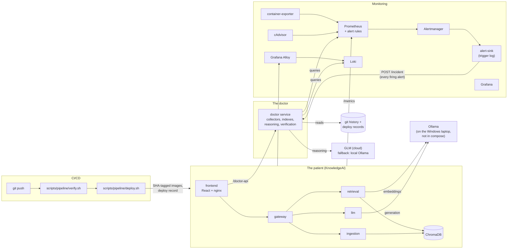

# AI Incident Doctor

Final-year project for **Intelligent Developer Tools and AI DevOps Workflows**.

There are two systems in this repository, and they are kept apart on purpose:

- **The patient** (`patient/`): *KnowledgeAI*, a document question-answering
  app (retrieval-augmented generation). Four FastAPI services, a ChromaDB vector
  store, a React UI, and a local `llama3.2` model served by Ollama. This is the
  app that gets deployed, monitored, and broken on purpose.
- **The doctor** (`doctor/`): the new system. It watches the patient. When
  something breaks it collects the evidence, works out the root cause, proposes
  a code fix, checks that fix against the tests, and writes a report. Its
  reasoning runs on a cloud model (GLM) so that it keeps working even when the
  patient's local Ollama is the thing that is broken.

The project is judged on **measured results**, not on a demo. `RESULTS.md` has
the numbers. `DECISIONS.md` explains every design choice. `PAVILION.md` says
what changes when the patient moves to the second laptop.

---

## How it fits together



How a fault flows through the system:

1. A change is pushed. The pipeline runs lint and tests, builds images tagged
   with the git SHA, deploys them, and writes a **deploy record**. The pipeline
   stops there. **It never calls the doctor.**
2. Something goes wrong. Prometheus evaluates the alert rules; Alertmanager
   sends the alert to **alert-sink**. alert-sink appends it to the trigger log
   and immediately POSTs it to the doctor.
3. The doctor opens an incident and waits for the incident window to close.
   Then it snapshots the evidence to disk: logs grouped by error signature,
   metrics compared with a baseline window, the deploys and commits before the
   alert, and the source code named in stack traces.
4. It asks the model for a schema-checked diagnosis, which includes ranked
   causes, the suspected commit (or none), the incident class, and a fix.
5. It renders the fix as a unified diff and runs the test suite on a throwaway
   copy. The fix is marked **verified** only if every test passes.
6. The report appears on the **Incidents** page. Nothing is ever applied to
   the running system.

There are three ways to wake the doctor, and **only** these three:

| Trigger | Who uses it | How |
|---|---|---|
| Alert | automatic | alert-sink -> `POST /incident` |
| Ticket | a person, when no alert fired | `POST /ticket` with free text ("since this morning answers are nonsense"), or the form on the Incidents page. The doctor finds the time window from the text and the metrics. |
| Replay | the evaluation | `python -m app.replay <incident-id or bundle.json>` (run from `doctor/`) |

---

## Ports

These are the default host ports. Each one can be changed with
`<NAME>_HOST_PORT` in `.env`. The development laptop moved every port up by
10000, because another project was already using the defaults.

| Service | Port | What it is |
|---|---|---|
| frontend | 3001 | the KnowledgeAI UI, including the **Incidents** page |
| gateway | 8000 | the patient's API (`/api/...`, `/metrics`) |
| ingestion / retrieval / llm | 8001 / 8002 / 8003 | the other patient services |
| chroma | 8010 | the vector store |
| doctor | 8100 | the incident doctor |
| grafana | 3000 | dashboards (anonymous viewing; admin password is in `.env`) |
| prometheus | 9090 | metrics and alert rules |
| alertmanager | 9093 | alert routing |
| alert-sink | 9095 | the incident trigger log (`GET /alerts`) |
| loki | 3100 | logs |
| alloy | 12345 | log shipper UI |
| cadvisor | 8080 | container metrics |
| mlflow | 5000 | evaluation runs |
| minio | 9000 / 9001 | object storage for MLflow and DVC (API / console) |
| Ollama | 11434 | **not in compose**; runs on the Windows laptop |

---

## Setup from a fresh Ubuntu install

These are the steps for the HP Pavilion. Ollama keeps running on the Windows
laptop; see `PAVILION.md` for that side.

```bash
# 1. Docker Engine and the compose plugin
sudo apt-get update
sudo apt-get install -y ca-certificates curl git python3 python3-pip python3-venv
sudo install -m 0755 -d /etc/apt/keyrings
sudo curl -fsSL https://download.docker.com/linux/ubuntu/gpg -o /etc/apt/keyrings/docker.asc
echo "deb [arch=$(dpkg --print-architecture) signed-by=/etc/apt/keyrings/docker.asc] \
  https://download.docker.com/linux/ubuntu $(. /etc/os-release && echo $VERSION_CODENAME) stable" \
  | sudo tee /etc/apt/sources.list.d/docker.list
sudo apt-get update
sudo apt-get install -y docker-ce docker-ce-cli containerd.io docker-compose-plugin
sudo usermod -aG docker "$USER"      # log out and back in

# 2. The code
git clone <your private repo URL> ai-incident-doctor
cd ai-incident-doctor
python3 -m venv .venv && . .venv/bin/activate
pip install -r requirements-dev.txt -r doctor/requirements.txt

# 3. Configuration
cp .env.example .env
#   set OLLAMA_BASE_URL and CONTAINER_OLLAMA_BASE_URL to http://<windows-laptop-LAN-IP>:11434
#   set GRAFANA_ADMIN_PASSWORD, MINIO_ROOT_PASSWORD, and DOCTOR_API_KEY (GLM)

# 4. The knowledge base (DVC). The first time, build it (this needs Ollama):
dvc repro build_kb          # later deploys use `dvc pull` from MinIO

# 5. Bring everything up (the deploy script builds SHA-tagged images and records the deploy)
python deploy/deploy.py --reason "first deploy on the Pavilion"
```

Then open `http://<pavilion>:3001` for the app, `:3000` for Grafana, and
`:8100/health` for the doctor.

## Registering the self-hosted GitHub Actions runner

Job 2 of `.github/workflows/ci.yml` deploys on every push to `main`. It runs
only on a self-hosted runner labelled `pavilion`, and never for pull requests.

1. On GitHub, open the repo, then *Settings -> Actions -> Runners -> New
   self-hosted runner -> Linux x64*, and copy the token it shows you.
2. On the Pavilion:
   ```bash
   mkdir ~/actions-runner && cd ~/actions-runner
   # download and unpack the runner tarball exactly as the GitHub page shows, then:
   ./config.sh --url https://github.com/<you>/<repo> --token <TOKEN> \
       --labels pavilion --name pavilion --unattended
   sudo ./svc.sh install && sudo ./svc.sh start
   ```
3. Give the runner machine configuration that lives outside the checkout:
   ```bash
   sudo mkdir -p /opt/aid/runtime && sudo chown -R "$USER" /opt/aid
   cp ~/ai-incident-doctor/.env /opt/aid/.env      # the job copies this into each checkout
   ```
   Deploy records go to `/opt/aid/runtime/deploys.jsonl`
   (`DEPLOY_LOG_PATH`). Set `RUNTIME_DIR=/opt/aid/runtime` in `/opt/aid/.env`
   so the doctor reads the same file.

Both jobs call the **same scripts** as the local pipeline:
`scripts/pipeline/verify.sh` and `scripts/pipeline/deploy.sh <sha>`. Every
deploy record says which pipeline produced it (`pipeline: github` or `local`).

### The local pipeline (used while developing)

Until the GitHub repository exists, a bare repository on this machine stands in
for it:

```bash
sh scripts/pipeline/init_local_pipeline.sh      # creates runtime/pipeline.git and the `pipeline` remote
git push pipeline main                          # verify.sh, then deploy.sh <sha>; the log path is printed
```

## The public link (optional)

`cloudflared` sits behind a compose profile that is off by default. It exposes
**only the frontend**.

```bash
docker compose --profile tunnel up -d cloudflared
docker compose logs cloudflared | grep trycloudflare.com    # temporary public URL
```

For a permanent hostname, create a named tunnel in the Cloudflare dashboard.
Point it at `http://frontend:8080`, then put its token in `.env` as
`CLOUDFLARE_TUNNEL_TOKEN`, and set `CLOUDFLARE_TUNNEL_ARGS=run`.

---

## Breaking it on purpose and measuring the doctor

```bash
python -m faults.background_traffic --hours 8 &             # normal traffic, for baselines
python -m faults.selfcheck                                  # every code fault passes CI yet fails its acceptance test
python -m faults.run_fault f1_embed_timeout --variant guilty_last
python -m faults.campaign                                   # the whole plan, unattended
python -m doctor.eval.run_eval                              # results tables from recorded incidents
```

| Fault | Delivery | Class | What happens |
|---|---|---|---|
| f1_embed_timeout | push | code_defect | embedding timeout 45 s -> 10 s; when Ollama is busy, the silent fallback answers with meaningless vectors |
| f2_capacity | environment | capacity | a chat surge saturates the single local model (no guilty commit) |
| f3_retrieval_down | environment | dependency_failure | retrieval container stopped |
| f3b_retrieval_bad_address | environment | dependency_failure | gateway pointed at a host that does not exist |
| f4_memory_leak | push | code_defect | a retrieval cache that never evicts; memory climbs until the container is killed |
| f5_typo | push | code_defect | a NameError on the branch taken by keyword queries only |
| f6_tight_timeout | push | code_defect | the gateway's LLM stream timeout is 3 s, so requests fail intermittently |
| f7_kb_missing_docs | data | data_issue | a knowledge-base version with 6 of the 10 documents missing is loaded |

`push` faults are real commits with ordinary messages. They land among
innocent distractor commits and go through the pipeline. `environment` and
`data` faults are applied by a recorded script. Every run records a timeline
(break -> alert -> report -> revert), the ground truth, and the doctor's
evidence snapshot, so the evaluation can replay each incident any number of
times.

## Tests and checks

```bash
sh scripts/pipeline/verify.sh     # ruff, yamllint, the three test suites, promtool, amtool, compose config
```
